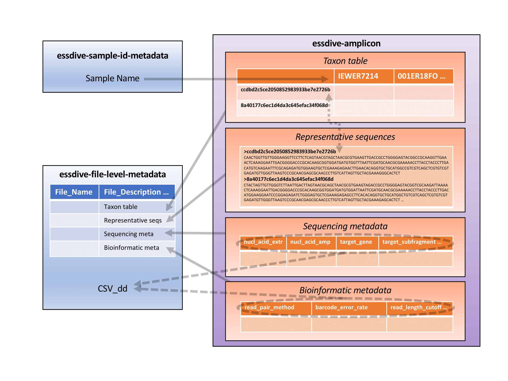

# Instructions for using the ESS-DIVE amplicon data reporting format

## ESS-DIVE Amplicon Data is reported in four file types:

(i) [Taxon tables](#i-taxon-tables) (also called sequence-by-sample or OTU/ESV tables)  
(ii) [Representative sequences](#ii-representative-sequence-files) (also called consensus sequences)  
(iii)[Sequencing metadata](#iii-sequencing-metadata)  
(iv) [Bioinformatic metadata](#iv-bioinformatic-metadata) 

These files are linked to each other and the rest of the data package. The column headers of the taxon table should be unique and match a Sample Name used in the Sample Metadata. The row headers of the taxon table should each match a description line preceding the associated sequence in the representative sequences FASTA file. If more than one table is submitted, [File Names](https://github.com/ess-dive-community/essdive-csv-structure/blob/master/csv_quick_guide.md#file-name) should indicate which representative sequences file corresponds to each taxon table. 

Examples: PROJECTNAME_ 97OTUS_TABLE.tsv, PROJECTNAME_ 97OTUS_SEQS.fasta

Finally, the File Names for taxon tables should be used as row headers in the metadata files in order to match the appropriate metadata with each table.

### (i) Taxon tables

Taxon tables are stored as data matrices in **Tab-separated Values (TSV) files**. 

With the exception of using a tab [delimiter](https://github.com/ess-dive-community/essdive-csv-structure/blob/master/csv_quick_guide.md#delimiter) rather than a comma, these files should follow the [ESS-DIVE Reporting Format for Comma-separated Values (CSV) File Structure](https://github.com/ess-dive-community/essdive-csv-structure):  
* Use the standard [US-ASCII](https://github.com/ess-dive-community/essdive-csv-structure/blob/master/csv_quick_guide.md#character-set) character encoding set without extensions or use UTF-8.  
* Organize the data as a [matrix of rows and columns](https://github.com/ess-dive-community/essdive-csv-structure/blob/master/csv_quick_guide.md#data-matrix) with no empty lines and the same number of columns for all rows.  
* Begin [column and row names](https://github.com/ess-dive-community/essdive-csv-structure/blob/master/csv_quick_guide.md#column-or-row-names) with letters and use only letters, numbers, hyphens, and underscores. Do not use spaces in the names.  

In the taxon table, the [column headers](https://github.com/ess-dive-community/essdive-csv-structure/blob/master/csv_quick_guide.md#column-or-row-name-orientation) identify samples. Column names should match the collector’s unique [IGSN identifiers](https://github.com/ess-dive-community/essdive-sample-id-metadata/blob/master/guide.md#igsn) assigned by SESAR or the project-specific [Sample Names](https://github.com/ess-dive-community/essdive-sample-id-metadata/blob/master/guide.md#sample-name) if not using IGSN ids. The first column header should be “SequenceID”. This column will contain the row headers.

Examples: IEWER7214, 001ER18FO

The [row headers](https://github.com/ess-dive-community/essdive-csv-structure/blob/master/csv_quick_guide.md#column-or-row-name-orientation) identify the operational taxonomic units (OTUs) or exact sequence variants (ESVs) into which amplicon sequences have been grouped. Row headers in the table should match the row headers in the representative sequences file.
Examples: OTU0018, 7bdb57487bee022ba30c03c3e7ca50e1

The [units](https://github.com/ess-dive-community/essdive-csv-structure/blob/master/csv_quick_guide.md#units) of the taxon TSV file are raw counts of each sequence per sample. The counts should be stored as integers and should not be normalized, standardized, or transformed. All cells must have a value; when an ESV or OTU has no counts in a sample, then a zero should be recorded.

The [File Name](https://github.com/ess-dive-community/essdive-csv-structure/blob/master/csv_quick_guide.md#file-name) of the taxon TSV file should match the File Name of the representative sequences FASTA file which contains the nucleotide sequences of the ESVs or OTUs in the table.

_How do I get this table from QIIME 2 output?_

Taxon tables can be obtained from QIIME 2 FeatureTable[Frequency] artifacts by performing the following steps:

1. [Export a FeatureTable[Frequency] artifact](https://docs.qiime2.org/2021.8/tutorials/exporting/#exporting-a-feature-table). The exported artifact will contain the FeatureTable as a BIOM 2.1.0 file.
2. Use [biom convert](https://biom-format.org/documentation/biom_conversion.html) to convert the BIOM file to a TSV file.
3. Open the TSV file. Remove extra lines above the data matrix and modify the first column header to “SequenceID”.

Example of the taxon table in a TSV file:

| SequenceID                       | SamP13A1 | SamP13A12 | SamP13A5 | SamP13A6 | SamP13A8 | SamP13A9 | SamP13B1 |
| -------------------------------- | -------- | --------- | -------- | -------- | -------- | -------- | -------- |
| ccdbd2c5ce2050852983933be7e2726b | 0        | 17        | 0        | 0        | 0        | 43       | 72       |
| 8a40177c6ec1d4da3c645efac34f068d | 0        | 0         | 0        | 0        | 0        | 0        | 0        |
| b82257b63539e2f75a1b76bb42813155 | 0        | 0         | 0        | 0        | 0        | 27       | 0        |

### (ii) Representative sequence files

Representative sequences are stored as [FASTA files](https://github.com/wrpearson/fasta36). Each entry of a representative sequence in the file includes a description line ([defline](https://blast.ncbi.nlm.nih.gov/Blast.cgi?CMD=Web&PAGE_TYPE=BlastDocs&DOC_TYPE=BlastHelp)) starting with “>”. This character is followed by a unique ID for the operational taxonomic unit (OTU) or exact sequence variant (ESV) to which the sequence has been assigned. These IDs match row headers in the SequenceID column of the associated taxon table.

The sequence for the ESV or OTU begins on the line following the defline and uses the [IUPAC](https://www.bioinformatics.org/sms/iupac.html) standard for nucleic acid codes. No lines are left blank between the defline and the sequence or between representative sequence entries.

Example of the representative sequences in a FASTA file:

>ccdbd2c5ce2050852983933be7e2726b
CAACTGGTTGTTGGGAAGGTTCCTTCTCAGTAACGTAGCTAACGCGTGAAGTTGACCGCCTGGGGAGTACGGCCGCAAGGTTGAAACTCAAAGGAATTGACGGGGACCCGCACAAGCGGTGGATGATGTGGTTTAATTCGATGCAACGCGAAAAACCTTACCTACCCTTGACATGTCAAGAATTTCGCAGAGATGTGGAAGTGCTCGAAAGAGAACTTGAACACAGGTGCTGCATGGCCGTCGTCAGCTCGTGTCGTGAGATGTTGGGTTAAGTCCCGCAACGAGCGCAACCCTTGTCATTAGTTGCTACGAAAGGGCACTCT  

>8a40177c6ec1d4da3c645efac34f068d
CTACTAGTTGTTGGGTCTTAATTGACTTAGTAACGCAGCTAACGCGTGAAGTAGACCGCCTGGGGAGTACGGTCGCAAGATTAAAACTCAAAGGAATTGACGGGGACCCGCACAAGCGGTGGATGATGTGGATTAATTCGATGCAACGCGAAAAACCTTACCTACCCTTGACATGGAAGGAATCCCGGAGAGATCTGGGAGTGCTCGAAAGAGAGCCTTCACACAGGTGCTGCATGGCTGTCGTCAGCTCGTGTCGTGAGATGTTGGGTTAAGTCCCGCAACGAGCGCAACCCTTGTCATTAGTTGCTACGAAAGAGCACTCT  

>b82257b63539e2f75a1b76bb42813155
GAACTAGGTGTGGGTCTCATTCCACGAGATCCGTGCCGCAGCTAACGCATTAAGTTCCCCGCCTGGGGAGTACGGCCGCAAGGCTAAAACTCAAAGGAATTGACGGGGGCCCGCACAAGCGGCGGAGCATGCGGATTAATTCGATGCAACGCGAAGAACCTTACCAAGGCTTGACATATGCGAGAACGCTGCAGAGATGCAGAACTCTTTGGACACTCGCATACAGGTGGTGCATGGTTGTCGTCAGCTCGTGTCGTGAGATGTTGGGTTAAGTCCCGCAACGAGCGCAACCCTCGTTCTATGTTGCCAGCACGTAATGGTGGGGACTCA

_How do I get this file from Qiime2 output?_

Representative sequences can be obtained from Qiime2 FeatureTable[Sequence] artifacts by performing the following steps:

1. Open the QIIME 2 artifact with representative sequences (Examples: rep-seqs-dada2.qza, rep-seqs-deblur.qza).
2. Use the [qiime tools export](https://docs.qiime2.org/2021.8/tutorials/exporting/) command to open the .qza artifact and retrieve the FASTA file containing the representative sequences.
3. Open the FASTA file and remove any extra lines above the defline for the first entry.

### (iii) Sequencing metadata

ESS-DIVE’s standard for amplicon data does not store information about the collection and storage of samples prior to sequencing, which should instead be captured by the [ESS-DIVE Sample Metadata](https://github.com/ess-dive-community/essdive-sample-id-metadata/blob/master/guide.md). The standard does not store all the information required to produce a taxon table from raw reads (for example, it does not record sequence barcodes for each sample in a study). Instead, ESS-DIVE amplicon metadata includes a single entry for each taxon table (and the associated representative sequences) uploaded in a data package. To the extent possible, metadata fields for this entry are defined to match those outlined in the Minimum Information about any Sequence ([MIxS](https://gensc.org/mixs/)) standards.

Sequencing metadata includes eight required and four recommended columns that record or link to information about the isolation of nucleic acids from samples, the enzymatic amplification of a target gene, and the sequencing of the resulting amplicons. These fields provide necessary provenance for the taxon table and its associated representative sequences. The header for each row in the metadata file indicates the table with which it is associated.

Sequencing metadata are stored in **Comma-separated Values (CSV) files**. These files should follow the [ESS-DIVE Reporting Format for Comma-separated Values (CSV) File Structure](https://github.com/ess-dive-community/essdive-csv-structure). Use the spreadsheet template as a guide for entering the sequencing metadata and save the file as a CSV. Enter one row to describe the origins of each taxon table in the data package.

[Link](https://github.com/ess-dive-community/essdive-amplicon/blob/main/templates_and_maps/ess-dive_amplicon_seq_instrument_terms_2021-10-03.csv) To see a list of options for sequencing instrument, consult the XLSX or CSV file with a guide to sequencing terms.

[Link](https://github.com/ess-dive-community/essdive-amplicon/blob/main/templates_and_maps/ess-dive_amplicon_sequencing_metadata_template_2021-10-03.csv) Download XLSX spreadsheet template for recording sequencing metadata.

[Link](https://github.com/ess-dive-community/essdive-amplicon/blob/main/templates_and_maps/ess-dive_amplicon_sequencing_metadata_template_2021-10-03.xlsx) Download CSV template for recording sequencing metadata.

[Link](https://github.com/ess-dive-community/essdive-amplicon/blob/main/templates_and_maps/ESS-DIVE_MIxS_crosswalk.xlsx) Download XLSX mapping of ESS-DIVE amplicon sequencing metadata terms to MIxS terms.

[Link](https://github.com/ess-dive-community/essdive-amplicon/blob/main/templates_and_maps/ESS-DIVE_MIxS_crosswalk.csv) Download CSV mapping of ESS-DIVE amplicon sequencing metadata terms to MIxS terms.

### (iv) Bioinformatic metadata

Sequencing metadata includes five required and six recommended columns that record information about the processing of raw sequence reads into a set of ESVs or OTUs and a taxon table. These fields provide necessary provenance for the taxon table and its associated representative sequences. The header for each row in the metadata file indicates the table with which it is associated.

Sequencing metadata are stored in **Comma-separated Values (CSV) files**. These files should follow the [ESS-DIVE Reporting Format for Comma-separated Values (CSV) File Structure](https://github.com/ess-dive-community/essdive-csv-structure). Use the spreadsheet template as a guide for entering the sequencing metadata and save the file as a CSV. Enter one row to describe the origins of each sequence-by-sample table in the data package.

For QIIME 2 users, a list of relevant plugins and parameters for the ESS_DIVE bioinformatic metadata fields is provided as an XLSX or CSV file.
[Link](https://github.com/ess-dive-community/essdive-amplicon/blob/main/templates_and_maps/ess-dive_amplicon_qiime2_plugin_metadata_map.xlsx)

[Link](https://github.com/ess-dive-community/essdive-amplicon/blob/main/templates_and_maps/ess-dive_amplicon_bioinformatic_metadata_template_2021-10-03.xlsx) Download XLSX spreadsheet template for recording bioinformatic metadata.

[Link](https://github.com/ess-dive-community/essdive-amplicon/blob/main/templates_and_maps/ess-dive_amplicon_bioinformatic_metadata_template_2021-10-03.csv) Download CSV template for recording bioinformatic metadata.
